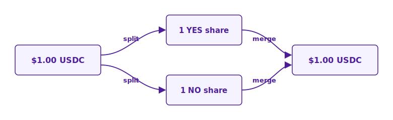
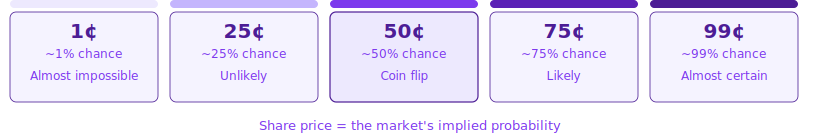

# What is Yes/No?

## Overview

**Yes/No — before it happens.** Yes/No lets anyone trade on the outcomes of real-world events — a forecasting and risk engine open to everyone.

You buy shares in the outcomes — **YES** or **NO** — of a specific condition. For example:

> Buy **YES** shares on _"Will BTC reach $100k this week?"_ at **15¢** each. The price implies a **15% chance** of the outcome. If it happens, each share redeems for **$1.00** — about a **6.7× return** ($1.00 ÷ $0.15). If it doesn't, the shares are worth **$0** after resolution.

## How a Share Works

Every market asks a yes/no question. You can buy two things:

* A **YES share** — worth **$1.00** if the event happens, **$0** if it doesn't
* A **NO share** — worth **$1.00** if the event doesn't happen, **$0** if it does

Because exactly one side will be right, one YES share plus one NO share is **always worth $1.00 together**.

This structure leads to three rules that hold at all times:

* **YES price + NO price ≈ $1.00.** If YES trades at 60¢, NO trades near 40¢.
* **Price = the market's implied probability.** YES at 60¢ means the market thinks there's a **60% chance** the event happens.
* **Prices always sit between 1¢ and 99¢.** The closer to 99¢, the more the market expects it to happen; the closer to 1¢, the less.

## How It Works

1. **Pick a market** — Browse live markets on crypto, sports, politics, and more.
2. **Buy shares** — Buy YES or NO at the current market price.
3. **Hold or sell early** — Keep until resolution, or sell anytime to lock in profit or cut losses.
4. **Settled automatically** — When the market resolves:
   * Winning shares pay **$1.00** each, losing shares go to **$0**
   * USDC is credited to your account — no claim step needed
   * Sold earlier? Your payout already happened at the sale price

## At a Glance

|                       |                                                                  |
| --------------------- | ---------------------------------------------------------------- |
| **Collateral**        | USDC                                                             |
| **Share price range** | **1¢ – 99¢** ($0.01 – $0.99)                                     |
| **Payout on win**     | $1.00 per share                                                  |
| **Payout on loss**    | $0 per share                                                     |
| **Market cycles**     | 5-minute, 15-minute, hourly, daily, weekly, and long-form events |

## Where to Next

* [Making Your First Trade](get-started/first-trade.md) — Get trading in minutes.
* [Trading Overview](trading/overview.md) — How the order book works.

## Join the Community

Chat with traders and the Yes/No team on [Discord](https://discord.gg/yesorno) or [Twitter](https://twitter.com/yesorno).


Need help? Use the **support** channel in the footer at [yesorno.trade](https://yesorno.trade), or reach out at **support@yesorno.trade**.

