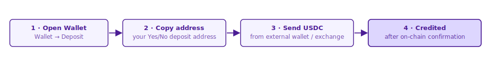

# Deposits & Withdrawals

Yes/No settles every trade, deposit, and payout in **USDC**. Deposit USDC to start trading; withdraw anytime back to your external wallet.

## Deposit Flow

Whether you signed in with a crypto wallet or with email, you deposit USDC into your Yes/No account before trading.

1. Open **Wallet → Deposit**
2. Copy your Yes/No deposit address
3. Send USDC to that address from an external wallet or exchange
4. USDC is credited once the network confirms the transaction

## Supported Networks

Yes/No only accepts USDC on the networks listed on the **Deposit** page. Sending from any other network may result in **permanent loss of funds**.


Always confirm the network before sending. Tokens sent on the wrong chain cannot be recovered.


## Minimums

| Action        | Minimum |
| ------------- | ------- |
| Deposit USDC  | 10 USDC |
| Withdraw USDC | 10 USDC |

Standard network gas applies to on-chain transactions.

## Withdrawal Flow

1. Open **Wallet → Withdraw**
2. Enter the destination address and amount
3. Confirm the network
4. Submit

Most withdrawals process within a few minutes; final settlement depends on the network.

## Troubleshooting

### Deposit Not Showing Up

1. Confirm the transaction was sent on a **supported network**
2. Wait for the network's required confirmations
3. Look up the transaction hash on a block explorer
4. If still missing after 30 minutes, email **support@yesorno.trade** with the transaction hash

### Withdrawal Is Pending

Large or unusual withdrawals may be held briefly for manual review. You'll receive an email if anything is needed from your side.

### Sent to the Wrong Network

Funds sent on an unsupported network are generally **unrecoverable**. Always verify the network indicator on the Deposit page first.

## Security

* Double-check the destination address before confirming
* Trust the network indicator on the Deposit page — not third-party sources
* Yes/No will **never** ask for a "verification" transaction by DM

For more, see [Sign Up & Wallet → Account Security](sign-up-and-wallet.md#account-security).
