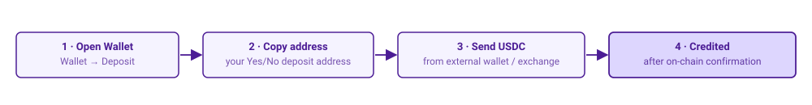

# Deposits & Withdrawals

Probly settles every trade, deposit, and payout in **USDC**. Deposit USDC to start trading; withdraw anytime back to your external wallet.

## Deposit Flow

<figure><picture><source srcset="../.gitbook/assets/get-started_deposits-and-withdrawals_1-dark.svg" media="(prefers-color-scheme: dark)"></picture><figcaption></figcaption></figure>

Whether you signed in with a crypto wallet or with email, you deposit USDC into your Probly account before trading.

1. Open **Wallet → Deposit**
2. Copy your Probly deposit address
3. Send USDC to that address from an external wallet or exchange
4. USDC is credited once the network confirms the transaction

## Supported Networks

Probly only accepts USDC on the networks listed on the **Deposit** page. Sending from any other network may result in **permanent loss of funds**.


Always confirm the network before sending. Tokens sent on the wrong chain cannot be recovered.


## Minimums & Fees

| Action        | Minimum | Fees           |
| ------------- | ------- | -------------- |
| Deposit USDC  | 3 USDC  | 0 USDC         |
| Withdraw USDC | 4 USDC  | 0.1 - 1.5 USDC |

### Fee Types

#### **Platform Fees**

**Purpose:** Cover the cost of bridging assets to your selected destination chain.

**Charges:**

* Deposits: Free (Currently waived)
* Withdrawals: Chain-based platform fees
  * Arbitrum: 0.1 USDC
  * Base: 0.1 USDC
  * Polygon PoS: 0.1 USDC
  * Ethereum: 0.5 USDC
  * Solana: 0.3 USDC

#### **One-time Account Transfer Fee**

**Purpose:** Probly operates on TxFlow L1, where transfers are generally free. To prevent spam and Sybil attacks, a one-time security fee applies only when transferring to a new address. This is a network protection measure, not a revenue-generating fee.

**Charges:**

* Deposits: Free (Currently waived)
* Withdrawals: 1 USDC charged **once per destination address** on the **first withdrawal** to that address.

#### **Network Fees**

**Purpose:** Network fees are charged by the blockchain to process on-chain transactions and are paid to network validators, **not Probly**.

Standard network gas fees apply to all on-chain transactions.


**Fee summary**

* Deposits: Free (fees are currently waived).
* **First withdrawal** to a **new address**: Applicable c**hain-based platform fee** + 1 USDC **one-time account transfer fee**, excluding network gas fees.
* Subsequent withdrawals to the **same address**: Applicable **chain-based platform fee only**, excluding network gas fees.
* Subsequent withdrawals to a **different address**: Applicable chain-based platform fee + **1 USDC one-time account transfer fee** for the new address, excluding network gas fees.


## Withdrawal Flow

<figure><picture><source srcset="../.gitbook/assets/get-started_deposits-and-withdrawals_2-dark.svg" media="(prefers-color-scheme: dark)"></picture><figcaption></figcaption></figure>

1. Open **Wallet → Withdraw**
2. Enter the destination address and amount
3. Confirm the network
4. Submit

Most withdrawals process within a few minutes; final settlement depends on the network.

## Troubleshooting

### Deposit Not Showing Up

1. Confirm the transaction was sent on a **supported network**
2. Wait for the network's required confirmations
3. Look up the transaction hash on a block explorer
4. If still missing after 30 minutes, email **support@probly.com** with the transaction hash

### Withdrawal Is Pending

Large or unusual withdrawals may be held briefly for manual review. You'll receive an email if anything is needed from your side.

### Sent to the Wrong Network

Funds sent on an unsupported network are generally **unrecoverable**. Always verify the network indicator on the Deposit page first.

## Security

* Double-check the destination address before confirming
* Trust the network indicator on the Deposit page — not third-party sources
* Probly will **never** ask for a "verification" transaction by DM

For more, see [Sign Up & Wallet → Account Security](sign-up-and-wallet.md#account-security).
