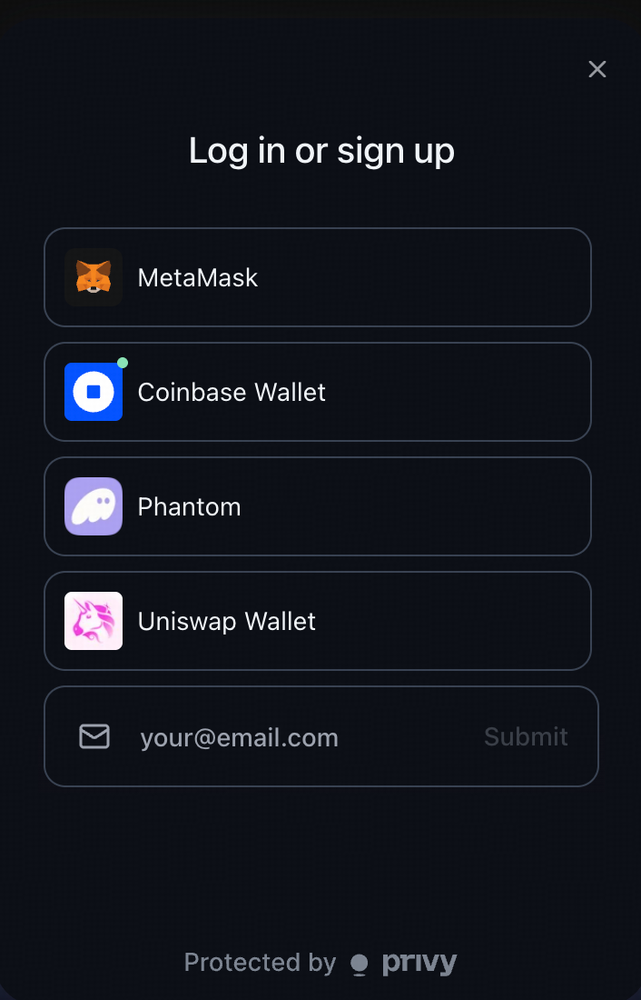
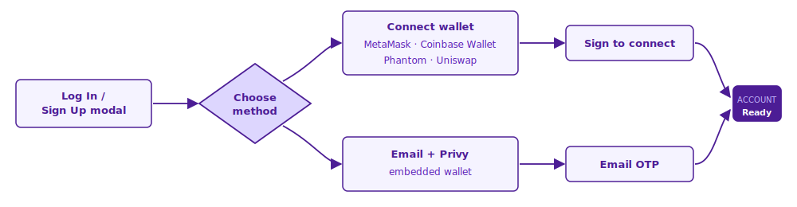

# Sign Up & Wallet

Getting started on Yes/No takes less than a minute. The same modal handles both signup and login — the first time you use a method, we create your account; after that, the same method logs you in.


**One modal, five methods.** Yes/No doesn't separate "Sign up" from "Log in". Click either **Log In** or **Sign Up** in the top bar — you'll see the same five options.


## Signup Methods

Yes/No supports **five** sign-in methods, powered by [Privy](https://privy.io/) for identity and embedded wallets.

<figure><figcaption></figcaption></figure>

### Crypto Wallets

Connect a self-custodied wallet. You hold your own keys and sign every transaction.

* **MetaMask**
* **Coinbase Wallet**
* **Phantom**
* **Uniswap Wallet**

### Email Login

Don't have a wallet? Sign in with email. Privy provisions a secure **embedded wallet** on your behalf — no seed phrase to manage, no extension to install.

* Enter your email → get a one-time code
* A wallet is created and stored with Privy
* Recovery via your email

## Comparison

|              | Crypto Wallet           | Email Login       |
| ------------ | ----------------------- | ----------------- |
| Onboarding   | Connect existing wallet | Verify email      |
| Keys held by | You                     | Privy (encrypted) |
| Recovery     | Your seed phrase        | Email             |
| Gas handling | You pay gas             | Handled for you   |

## "Last Used" Memory

The modal remembers the last method you used and shows a **Last used** badge next to it, moving it to the top of the list so you don't have to scroll on your next visit.

* Remembered across sessions via local storage
* Reset by clearing your browser data
* Email login also shows the badge if it was last used

## Creating Your Account

1. Go to [yesorno.trade](https://yesorno.trade)
2. Click **Log In** or **Sign Up** in the top right
3. Pick one of the five methods
4. Sign / verify to confirm
5. Accept the [Terms of Use](../resources/terms-of-service.md) and [Privacy Policy](../resources/privacy-policy.md)
6. You're in — deposit USDC to start trading

## Account Security


**Never share** your password, seed phrase, or private key. Yes/No staff will never ask for them via DM, email, or Discord.


* Use strong, unique passwords for your email account
* For self-custody wallets, back up your seed phrase offline
* Always verify you're on **yesorno.trade** before connecting your wallet
* Report suspicious activity to **support@yesorno.trade**

## Next Steps

* [Deposits & Withdrawals](deposits-and-withdrawals.md) — fund your account with USDC
* [Making Your First Trade](first-trade.md) — place your first order
