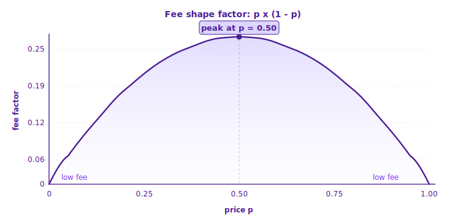

# Fees

Yes/No charges a small **taker fee** on trades that match immediately against the order book. Fees are paid in **USDC** and applied automatically at match time.

**Only takers pay.** Limit orders that rest on the book (makers) are never charged. See [How Orders Match](../trading/matching-logic.md) for how maker vs taker is decided.

## Fee Formula

```
takerFee = C × p × takerFeeRate × (p × (1 − p))^exponent
```

| Symbol           | Meaning                                      |
| ---------------- | -------------------------------------------- |
| **C**            | Number of shares traded                      |
| **p**            | Execution price (between 0.01 and 0.99 USDC) |
| **takerFeeRate** | Per-market fee rate                          |
| **exponent**     | Per-market curve exponent                    |


**takerFeeRate** and **exponent** are set per market and published on the market page before you trade.


## The Fee Curve

The factor _p × (1 − p)_ shapes the curve — it peaks at _p = 0.50_ and tapers toward both extremes:



In practice:

* **Fees peak at 50% probability** — where uncertainty is highest
* **Fees shrink toward both ends** — a heavy favorite at 95¢ costs much less to trade than a coin-flip at 50¢
* **Symmetric around 50¢** — a trade at 30¢ costs the same dollar fee as the same-size trade at 70¢
* **Very small trades near the extremes may incur no fee at all** (see [Fee Precision](#fee-precision))

## How You're Charged

The fee is shown **separately from the order value** — the number of shares you enter is exactly the number you receive (or deliver). Fees are never deducted from your input.

| Field                  | What it means                                                     |
| ---------------------- | ----------------------------------------------------------------- |
| **Shares**             | Exactly what you'll receive (buy) or deliver (sell)               |
| **Order Value**        | Shares × Price                                                    |
| **Est. Fee**           | The taker fee estimate in USDC                                    |
| **Total** (buy)        | Order Value + Est. Fee — the exact amount that leaves your wallet |
| **Net Receive** (sell) | Order Value − Est. Fee — the USDC credited to your account        |

For the same size and price, the USDC fee is identical in either direction.

## Estimate vs Actual

The **Est. Fee** is calculated at the **highest possible rate** (fully taker at _p = 0.50_). The **actual fee** is set at match time from the fill price — so the final amount is **at most** the estimate, usually less.

> Hover the **ⓘ** icon next to **Total** (buy) or **Net Receive** (sell) to see the breakdown.

## Worked Example

Buying **5 shares** at a limit price of 80¢:

| Field       | Value                              |
| ----------- | ---------------------------------- |
| Shares      | 5                                  |
| Order Value | 5 × $0.80 = $4.00                  |
| Est. Fee    | ≈ $0.03                            |
| **Total**   | **$4.03**                          |
| To Win      | $5.00 if YES wins ($0 if it loses) |

You pay **$4.03** and receive exactly **5 shares**.

### Curve Factor at Key Prices

| Price (p) | Curve factor (p × (1 − p)) | Relative fee   |
| --------- | -------------------------- | -------------- |
| 50¢       | 0.2500                     | Highest        |
| 40¢ / 60¢ | 0.2400                     | Slightly lower |
| 30¢ / 70¢ | 0.2100                     | Moderate       |
| 10¢ / 90¢ | 0.0900                     | Low            |
| 5¢ / 95¢  | 0.0475                     | Very low       |

## Fee Precision

* Fees are rounded to 4 decimal places in USDC
* Smallest charged: **0.0001 USDC**
* Anything below that rounds to zero — very small trades near the price extremes may incur no fee at all

## Where to Find Your Fee

* **Before** a trade — estimated fee and final total appear in the order panel
* **After** a trade — the exact fee appears on each fill under **Portfolio → History**

## Related

* [How Orders Match](../trading/matching-logic.md) — how maker / taker is determined
* [Market Orders](../trading/market-orders.md) — execute immediately at the best price
* [Limit Orders](../trading/limit-orders.md) — rest on the book at your chosen price
* [Deposits & Withdrawals](../get-started/deposits-and-withdrawals.md) — no platform fee, only network gas
* [Referrals](referrals.md) — earn a share of fees from users you invite
