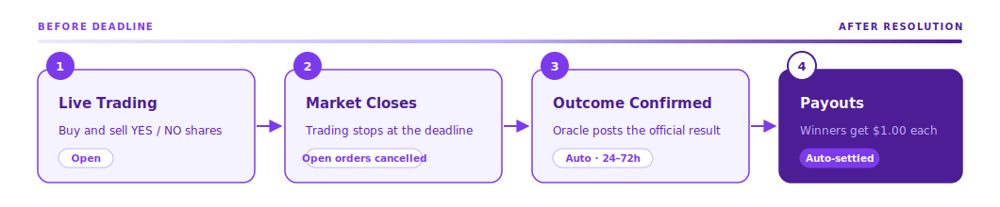
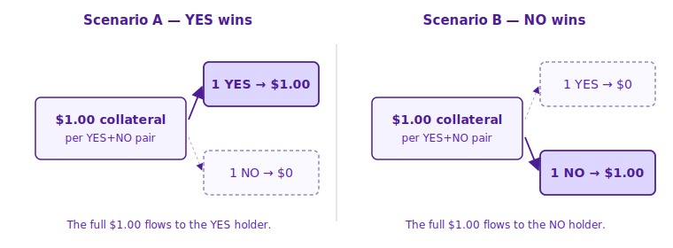

# Market Resolution

Every market on Yes/No has a defined **resolution condition** and **deadline**. When the deadline passes, the market is resolved against an objective data source. Winning shares redeem for **$1.00** each; losing shares go to **$0**.

## Market Lifecycle

## Resolution Process

### 1. Market Deadline Passes

Each market has a specific deadline (e.g. **Feb 16, 17:00 UTC**). No new trades are accepted after that moment.

### 2. Oracle Reports the Outcome

The designated oracle source provides the verified result.

* **Automated price feeds** (crypto, stocks, other numeric data) resolve immediately at the deadline
* **Manual resolution** (sports, politics, custom events) typically takes **24–72 hours** after the deadline, depending on event complexity and data availability


The **exact resolution source and criteria** are published on each market's page. Always read these before trading — they are the rulebook the market is judged by.


### 3. Winning Shares Pay Out

* **Winning** shares (YES or NO, depending on outcome) redeem for **$1.00 USDC** each
* **Losing** shares become worth **$0**
* Payouts settle on-chain automatically — no claim step needed

## What Happens to Open Orders

When the deadline passes:

* All open limit orders are **cancelled automatically**
* Locked USDC (for buy orders) is returned to your available balance
* Locked shares (for sell orders) are returned to your position

## Payouts

Once resolution is finalized, payouts show up in your portfolio automatically. Every **1 YES + 1 NO pair** was originally collateralized by $1.00 USDC — at resolution that dollar flows entirely to the winning side:

| You held | Market resolved | You get                   |
| -------- | --------------- | ------------------------- |
| 100 YES  | YES             | 100 × $1.00 = **$100.00** |
| 100 YES  | NO              | $0                        |
| 100 NO   | NO              | 100 × $1.00 = **$100.00** |
| 100 NO   | YES             | $0                        |

For **category markets**, only YES on the winning outcome pays $1.00; every other YES resolves to $0 (NO is the mirror image). See [Category Markets](../trading/category-markets.md).

## Final Resolutions

A market that resolves **consistent with its published rules** is **final**. Disagreeing with the real-world outcome, or missing the deadline, does not qualify a position for a refund.


Always read the **resolution criteria** on the market page before trading. That's the rulebook the market will be judged by — not the event itself.


## Exceptional Situations

In rare cases — a resolution source becoming unavailable, an event being cancelled or indefinitely postponed, a materially ambiguous outcome, or a critical setup error — a market may be **voided**. Any void is announced on the affected market page and handled on a case-by-case basis under the [Terms of Use](../resources/terms-of-service.md).

## Related

* [Refund Policy](../resources/refund-policy.md) — when markets may be voided
* [Terms of Use](../resources/terms-of-service.md) — binding rules and dispute procedure
* [Merging & Splitting Shares](../trading/merging-and-splitting.md) — convert between USDC and share-pairs
