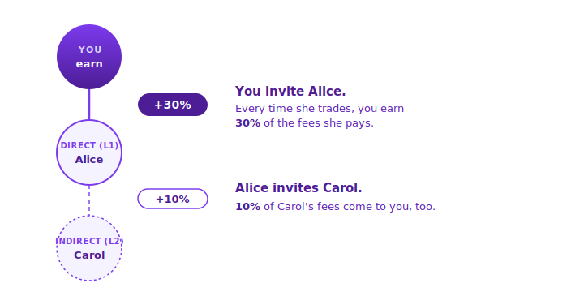

# Referrals

Share your link and you'll earn a cut of the **trading fees** paid by anyone who joins through it. Earnings accrue for as long as your invitees keep trading — with **no cap**.

## How It Works

<figure><picture>
  <source srcset="../.gitbook/assets/settlement_referrals_1-dark.svg" media="(prefers-color-scheme: dark)">
  
</picture></figure>

| Level             | Who they are                           | You earn                      |
| ----------------- | -------------------------------------- | ----------------------------- |
| **Direct (L1)**   | Users you invited yourself             | **30%** of their trading fees |
| **Indirect (L2)** | Users invited by your direct referrals | **10%** of their trading fees |

Rewards are calculated on every trade and credited to your account automatically.

### A Simple Example

Suppose **Alice** is your direct invitee, and Alice invited **Carol**. Over a week, their fees add up like this:

| Trader                   | Fees they paid | Your share | You earn |
| ------------------------ | -------------- | ---------- | -------- |
| **Alice** (Direct, L1)   | $100           | 30%        | **$30**  |
| **Carol** (Indirect, L2) | $50            | 10%        | **$5**   |
| **Total this week**      | —              | —          | **$35**  |

Earnings scale linearly with your invitees' activity — no cap.

## Using the Program

Creating a referral code unlocks once you reach a **lifetime trading volume threshold**. Track your progress on the **Refer & Earn** page.

Once unlocked:

1. Open **Refer & Earn** from the avatar menu in the top right
2. Pick a code (3–30 letters or numbers)
3. Share your link — `yesorno.trade/?r={your-code}`

The dashboard shows **Sign-ups**, **Active Traders** (last 24h), and cumulative **Earnings** over 7D / 30D / 90D / all-time. Rewards settle in USDC automatically — no claim button.

## Related

* [Fees](fees.md) — how trading fees are calculated
* [Sign Up & Wallet](../get-started/sign-up-and-wallet.md) — how new users join Yes/No
