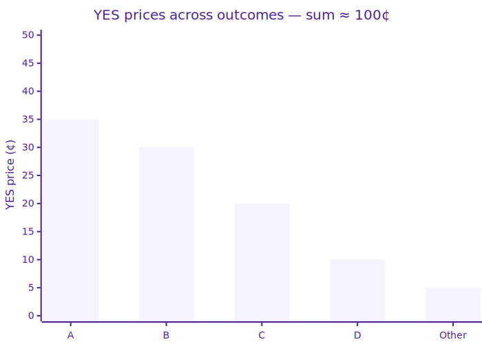

# Category Markets

## What Are Category Markets?

Category markets are prediction markets where **multiple outcomes are grouped together and only one can happen**. Think of them as a multiple-choice question — exactly one outcome wins, the rest lose.

> **Example.** _"Who will win the 2028 US Presidential Election?"_

| Outcome      | YES     | NO  |
| ------------ | ------- | --- |
| Candidate A  | **35¢** | 65¢ |
| Candidate B  | **30¢** | 70¢ |
| Candidate C  | **20¢** | 80¢ |
| Candidate D  | **10¢** | 90¢ |
| Someone else | **5¢**  | 95¢ |

At resolution, exactly one YES outcome pays **$1.00** and all others go to $0 (the NO side is the mirror image).

## Binary vs Category

|            | Binary market     | Category market                |
| ---------- | ----------------- | ------------------------------ |
| Outcomes   | 2 (YES / NO)      | N (one per candidate / bucket) |
| Winner     | 1 of 2            | 1 of N                         |
| Price sum  | YES + NO ≈ $1.00  | Sum of all YES prices ≈ $1.00  |
| Order book | 1 (for YES vs NO) | 1 per outcome                  |

## Why They're Different

In a standard binary market, YES + NO = $1.00 and that's the end of it. In a category market:

* **Each outcome has its own YES and NO order book** — you can trade either side of any outcome
* **The YES prices across all outcomes should sum to roughly $1.00** — because exactly one will win
* **Category markets unlock richer views** — e.g. betting against one candidate while spreading exposure across the others

## Trading in Category Markets

You trade them the same way you trade binary markets:

* **Buy YES on the outcome you believe in** — wins if that specific outcome happens
* **Buy NO on an outcome you don't believe in** — wins if **any other** outcome happens
* **Combine positions** across multiple outcomes for hedged or spread strategies

The order book, matching, and payouts all work identically to binary markets — see [Trading Overview](overview.md), [Market Orders](market-orders.md), and [Limit Orders](limit-orders.md).

## Prices Reflect Probability

Since exactly one outcome wins, the YES prices across all outcomes add up to approximately $1.00.

The market is pricing in: Candidate A \~35%, B \~30%, C \~20%, D \~10%, Someone else \~5% → total \~100%.


If Outcome A is trading at 60¢, the market is telling you it thinks A has a **\~60% chance** of winning — a number you can compare against polls, models, or your own view.


## Resolution

At the market deadline:

| Shares held | Outcome wins        | Outcome loses       |
| ----------- | ------------------- | ------------------- |
| **YES**     | Redeem at **$1.00** | Go to **$0**        |
| **NO**      | Go to **$0**        | Redeem at **$1.00** |

See [Market Resolution](../settlement/market-resolution.md) for the full resolution process.

## Related

* [Trading Overview](overview.md) — how the order book works
* [Market Resolution](../settlement/market-resolution.md) — how winning outcomes are determined
* [Merging & Splitting Shares](merging-and-splitting.md) — converting between USDC and shares
