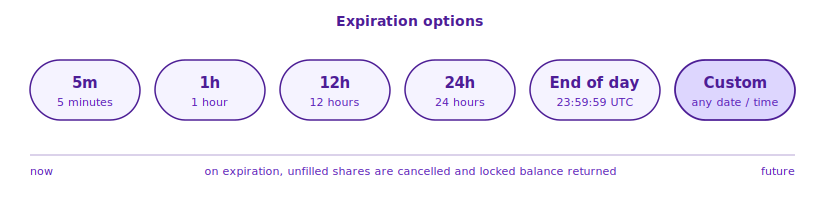

# Limit Orders

A **limit order** lets you set the exact price you want to pay (or receive) and rests on the book until a matching order arrives. Use it when you care more about price than speed.


A limit order gives you **full control over the execution price**. If no one is willing to trade at that price yet, your order simply sits in the book until someone is — or until you cancel it.


## Buy vs Sell

| | What you enter | What you pay / receive |
| --- | --- | --- |
| **Buy (Limit)** | Price + shares | Total ≈ price × shares |
| **Sell (Limit)** | Price + shares | Receive ≈ price × shares |

A buy limit order sits on the **Bids** side of the book. A sell limit order sits on the **Asks** side.

## Quick Example

You think YES is worth more than 60¢ but you'd only buy it at 58¢ or lower. Place a limit order:

1. Select **YES** → **Buy** → **Limit**
2. Set **Limit Price** = 58¢
3. Set **Shares** = 100
4. Panel shows:
   * **Order Value** = 0.58 × 100 = $58.00
   * **Est. Fee** (shown separately — only charged if the order is matched immediately as a taker)
   * **Total** = Order Value + Est. Fee — the amount locked when you submit
   * **To Win** = 100 × $1.00 = $100.00 if YES wins (or $0 if YES loses)
5. Submit → order rests on the book at 58¢ until a seller matches it

## Price Input

* Range: from the market's minimum tick to **99.9¢**
* Click ± buttons to step by one tick (usually 1¢)
* Hover shows the equivalent **American** and **Decimal** odds


**Tick size is per-market.** Most markets use 1¢ ticks, but some use finer ticks (e.g. 0.1¢). The Limit Price input enforces the market's tick automatically.


## Shares Input

* Minimum: **5 shares**
* Precision: up to 2 decimal places (e.g. 5.25)
* Quick buttons for Buy: **±10 / ±100**
* Quick buttons for Sell: **25% / 50% / Max**

## To Win & Odds Conversion

Every limit order panel shows the same trade in three formats:

| Format | Example | Meaning |
| --- | --- | --- |
| **Price (¢)** | 60.9¢ | Implied probability = 60.9% |
| **American** | −155.6 | Bet 155.6 to win 100 |
| **Decimal** | 1.643 | 1 USDC returns 1.643 USDC |

Hover the **ⓘ** icons next to **To Win** and **Total** to see the conversion.

## Immediate-Match Hint

If your limit price crosses the spread (e.g. a buy limit at 95¢ when asks are at 91¢), the engine will **immediately match** the portion it can fill at or better than your price:

* Panel shows a green **"X matching"** badge for the portion that will fill immediately
* Any remaining shares rest on the book at your chosen price

So a single limit order can be **part executed, part resting**.

## Set Expiration

Limit orders default to **Good 'til Cancelled (GTC)** — they rest on the book until you cancel or they fill. Enable **Set Expiration** to auto-cancel after a specific duration:

| Option | Behavior |
| --- | --- |
| **5m** | 5 minutes from order time |
| **1h** | 1 hour from order time |
| **12h** | 12 hours from order time |
| **24h** | 24 hours from order time |
| **End of day** | 23:59:59 UTC today |
| **Custom** | Pick any date + time in the future |

On expiration, unfilled shares are automatically cancelled and any locked balance is returned to your wallet.

## Order States

A limit order passes through:

| State | Meaning |
| --- | --- |
| **Open** | Resting on the book, not yet matched |
| **PartiallyFilled** | Some shares filled; the rest still resting |
| **Filled** | Fully executed |
| **Cancelled** | You cancelled before a full match |
| **Expired** | Expiration time passed with open shares remaining |

Open limit orders can be viewed and cancelled anytime from **Portfolio → Open Orders**, or directly on the market page when an open-order badge appears.

## Related

* [Market Orders](market-orders.md) — no price control, but instant
* [How Orders Match](matching-logic.md) — price-time priority explained
