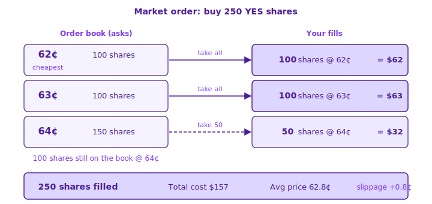

# Market Orders

A **market order** executes immediately against the best available resting orders on the book. Use it when you want instant execution and don't mind paying the prevailing price.


A market order takes the **best available prices currently on the book**. In thin markets it may walk through several price levels — see [Slippage](#slippage).


## Buy vs Sell

The input differs:

|                   | What you enter                    | What you receive                          |
| ----------------- | --------------------------------- | ----------------------------------------- |
| **Buy (Market)**  | **USD amount** (e.g. $50)         | Shares ≈ amount ÷ estimated average price |
| **Sell (Market)** | **Number of shares** (e.g. 100)   | USD ≈ shares × estimated average price    |

The order panel updates the estimated average price in real time based on current book depth.

## Buy Example

You want to bet $50 on YES in a market trading at 60¢:

1. Select **YES → Buy → Market**
2. Enter **$50**
3. Panel shows:
   * Estimated average price ≈ 60¢
   * Shares ≈ 50 ÷ 0.60 ≈ **83.33**
   * **To Win** ≈ $83.33 if YES wins, or $0 if it loses _(total payout, includes your stake — net profit on win ≈ $83.33 − $50 = $33.33)_
   * **Total** = Order Value + Est. Fee — the exact amount leaving your wallet
4. Click **Buy** → matches against resting asks

## Sell Example

You want to sell 100 YES shares:

1. Select **YES → Sell → Market**
2. Enter **100** (or use the **25% / 50% / Max** quick buttons)
3. Panel shows:
   * Estimated average price
   * **You receive** — net USDC credited after the sale
4. Click **Sell** → matches against resting bids

## Slippage

If your order is larger than the liquidity at the best price, it walks up (or down) the book — you'll get an average price worse than the top quote. The panel estimates this in real time.

Example — you buy **250 shares**, but the best ask only has 100 resting. Your order walks up the book:

<figure><picture>
  <source srcset="../.gitbook/assets/trading_market-orders_1-dark.svg" media="(prefers-color-scheme: dark)">
  
</picture></figure>

The deeper your order walks, the worse your average. This is **slippage**.


In thin markets a large market order can move the price significantly. If you care about execution price, use a [Limit Order](limit-orders.md) instead.


## Partial Fills

If the book can't fully absorb your market order:

* The portion that matched executes immediately
* The unfilled portion is cancelled — market orders never rest on the book

## Related

* [Limit Orders](limit-orders.md) — control your execution price
* [How Orders Match](matching-logic.md) — how your order walks the book
