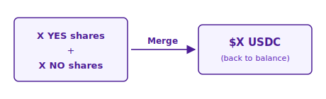

# Merging & Splitting Shares

Prediction markets have two primitives that don't exist in traditional trading: **Merge** and **Split**. They let you convert directly between USDC and a matched pair of YES + NO shares, without going through the order book.


Merge and Split are **executed directly by the protocol**, not against other users. That means no bid-ask spread and no impact on market price — useful when the book is thin or the spread is wide.


## The Core Identity

For every market, this is always true:

$$
\Large 1 \text{ YES share} + 1 \text{ NO share} = \$1.00 \text{ USDC}
$$

That's because exactly one side will ultimately redeem for $1.00 and the other for $0. Holding both sides guarantees exactly $1.00 at resolution, so the protocol lets you convert between them right now.

## Split: USDC → Shares

Lock $1 USDC and receive 1 YES share + 1 NO share.

### When to use

* You want to **short** an outcome you already have a view against — split, then sell the side you don't want
* You want to **accumulate inventory cheaply** without paying the spread
* You want to **express a nuanced view** by holding a different ratio of YES/NO than the market implies

### How it works

| Field | Description |
| --- | --- |
| Operation | Split |
| Amount | USDC amount to lock |
| Max | Your available USDC |

**Account changes after Split:**

* USDC → decreases by the amount you split
* YES shares → increase by the same amount
* NO shares → increase by the same amount

Your all-in cost is $1 per pair. If you sell one side later, the remaining side's effective cost is whatever you didn't recover — e.g. sell NO for 40¢, and your remaining YES effectively costs 60¢.

## Merge: Shares → USDC

Return 1 YES + 1 NO and receive $1 USDC back.

### When to use

* You want to **close a hedged position** without dealing with the spread
* You have matched YES + NO from separate buys and want to lock in the difference
* You want to **free up USDC** for another market

### How it works

| Field | Description |
| --- | --- |
| Operation | Merge |
| Amount | Number of share-pairs to merge |
| Max | The smaller of your YES balance and NO balance |

**Account changes after Merge:**

* YES shares → decrease by the amount you merge
* NO shares → decrease by the same amount
* USDC → increases by the same amount

## Related

* [Category Markets](category-markets.md) — multi-outcome markets
* [Market Resolution](../settlement/market-resolution.md) — how winning shares settle
