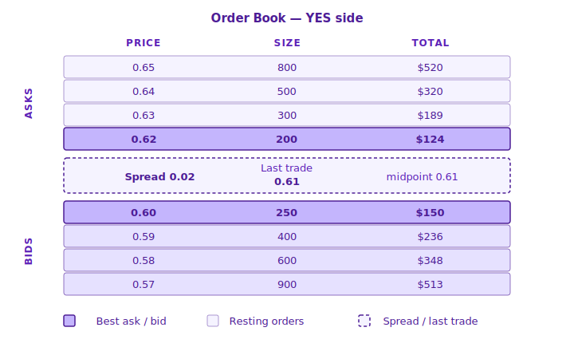

# Trading Overview

Trading on Yes/No runs on a **Central Limit Order Book (CLOB)** — the same model used by traditional exchanges. Every buy and sell is matched transparently against a public order book, user-to-user.

## How Shares Work

Every market on Yes/No has two outcome shares — **YES** and **NO** — priced between **1¢ and 99¢**.

* Price = implied probability (60¢ ⇒ market implies 60%)
* 1 YES + 1 NO is always collateralized by $1.00 USDC
* At resolution, the winning side pays $1.00 and the losing side pays $0

For a deeper walkthrough, see [What is Yes/No?](../#how-a-share-works).

## The Order Book

Each market has its own order book, split into **Asks** (sell orders) and **Bids** (buy orders). The best (top) ask and best bid sit next to each other, with the spread and last trade in between.

**Example — YES side of a market**

|          | Price   | Shares | Total (USDC) |
| -------- | ------- | ------ | ------------ |
| **Asks** | 93¢     | 12,500 | $11,625      |
|          | 92¢     | 30,000 | $27,600      |
|          | **91¢** | 8,200  | $7,462       |
| _Last_   | _90¢_   | _—_    | _Spread 2¢_  |
|          | **89¢** | 15,400 | $13,706      |
| **Bids** | 88¢     | 22,100 | $19,448      |
|          | 87¢     | 5,000  | $4,350       |

Asks list the **lowest ask at the top** of the sell side; bids list the **highest bid at the top** of the buy side — so the two best prices meet at the middle of the book.

| Column     | Meaning                                                                                   |
| ---------- | ----------------------------------------------------------------------------------------- |
| **Price**  | Price per share, in ¢ (0 – 100)                                                           |
| **Shares** | Number of shares resting at that price                                                    |
| **Total**  | Price × Shares ÷ 100, in USDC                                                             |
| **Last**   | The most recent executed trade                                                            |
| **Spread** | Lowest Ask − Highest Bid. A tighter spread means lower cost to enter and exit a position. |

Switch between YES and NO by clicking the other outcome card — the book layout is identical.

## Order Types

| Type                             | How it works                                                      |
| -------------------------------- | ----------------------------------------------------------------- |
| [Market Order](market-orders.md) | Executes immediately against the best available resting orders    |
| [Limit Order](limit-orders.md)   | Rests on the book at your chosen price until matched or cancelled |

## Buying YES vs Buying NO

Buying YES and buying NO are **symmetric**. At any moment:

* Price(YES) + Price(NO) ≈ $1.00
* Buying YES at **60¢** is equivalent to betting against NO at **40¢**

Use whichever side has better liquidity or is easier to reason about for a given market.

## Minimums & Precision

| Rule               | Value                              |
| ------------------ | ---------------------------------- |
| Minimum order size | **5 shares**                       |
| Price range        | **1¢ – 99¢**                       |
| Share precision    | Up to 2 decimal places (e.g. 5.25) |

Orders below the minimum are rejected by the exchange.

## Where to Next

* [Market Orders](market-orders.md) — instant execution
* [Limit Orders](limit-orders.md) — control your price with expiration options
* [How Orders Match](matching-logic.md) — price-time priority in detail
* [Category Markets](category-markets.md) — multi-outcome markets
* [Merging & Splitting Shares](merging-and-splitting.md) — convert between USDC and share pairs
* [Market Resolution](../settlement/market-resolution.md) — how winning shares pay out
